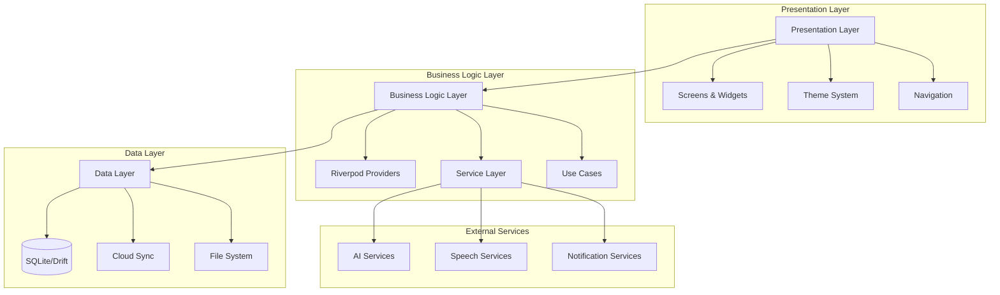

# Design Document

## Overview

The Task Tracker App is a sophisticated voice-driven mobile application built with Flutter 3.22+ that provides comprehensive task management capabilities. The app follows an offline-first architecture with optional cloud synchronization, leveraging modern technologies like Riverpod for state management, Material 3 for UI design, and advanced AI integration for intelligent task parsing.

### Key Design Principles

- **Offline-First**: All core functionality works without internet connectivity
- **Voice-Centric**: Primary interaction method through voice commands and speech recognition
- **Privacy-Focused**: Local data processing with optional cloud features
- **Cross-Platform**: Consistent experience across Android and iOS
- **Accessibility**: Full support for assistive technologies and inclusive design
- **Performance**: Optimized for smooth operation on various device capabilities

## Architecture

### High-Level Architecture



### Layered Architecture Pattern

1. **Presentation Layer**: Flutter widgets, screens, and UI components
2. **Business Logic Layer**: Riverpod providers, use cases, and business rules
3. **Data Layer**: Local database, file system, and external API integrations
4. **Service Layer**: External service integrations and platform-specific implementations

## Components and Interfaces

### Core Components

#### 1. Task Management System

**TaskModel**
```dart
class TaskModel {
  final String id;
  final String title;
  final String? description;
  final DateTime createdAt;
  final DateTime? dueDate;
  final TaskPriority priority;
  final TaskStatus status;
  final List<String> tags;
  final List<SubTask> subTasks;
  final String? locationTrigger;
  final RecurrencePattern? recurrence;
  final String? projectId;
  final List<String> dependencies;
}
```

**TaskRepository Interface**
```dart
abstract class TaskRepository {
  Future<List<TaskModel>> getAllTasks();
  Future<TaskModel?> getTaskById(String id);
  Future<void> createTask(TaskModel task);
  Future<void> updateTask(TaskModel task);
  Future<void> deleteTask(String id);
  Stream<List<TaskModel>> watchTasks();
  Future<List<TaskModel>> searchTasks(String query);
  Future<List<TaskModel>> getTasksByFilter(TaskFilter filter);
}
```

#### 2. Voice Processing System

**SpeechService Interface**
```dart
abstract class SpeechService {
  Future<bool> initialize();
  Future<String> transcribeAudio(String audioPath);
  Stream<String> startLiveTranscription();
  Future<void> stopTranscription();
  bool get isAvailable;
  bool get isListening;
}
```

**VoiceCommandProcessor**
```dart
class VoiceCommandProcessor {
  Future<VoiceCommand> parseCommand(String transcription);
  Future<TaskModel> createTaskFromVoice(String transcription);
  Future<void> executeVoiceCommand(VoiceCommand command);
}
```

#### 3. AI Integration System

**AITaskParser Interface**
```dart
abstract class AITaskParser {
  Future<ParsedTaskData> parseTaskFromText(String text);
  Future<List<String>> suggestTags(String taskText);
  Future<DateTime?> extractDueDate(String text);
  Future<TaskPriority> determinePriority(String text);
}
```

#### 4. Synchronization System

**SyncService Interface**
```dart
abstract class SyncService {
  Future<void> syncToCloud();
  Future<void> syncFromCloud();
  Stream<SyncStatus> get syncStatus;
  Future<void> resolveConflicts(List<SyncConflict> conflicts);
  Future<void> enableAutoSync(bool enabled);
}
```

### State Management Architecture

#### Riverpod Provider Structure

```dart
// Core Providers
final taskRepositoryProvider = Provider<TaskRepository>((ref) => TaskRepositoryImpl());
final speechServiceProvider = Provider<SpeechService>((ref) => SpeechServiceImpl());
final aiParserProvider = Provider<AITaskParser>((ref) => AITaskParserImpl());

// State Providers
final tasksProvider = StateNotifierProvider<TasksNotifier, AsyncValue<List<TaskModel>>>(
  (ref) => TasksNotifier(ref.read(taskRepositoryProvider))
);

final voiceRecordingProvider = StateNotifierProvider<VoiceRecordingNotifier, VoiceRecordingState>(
  (ref) => VoiceRecordingNotifier(ref.read(speechServiceProvider))
);

final appSettingsProvider = StateNotifierProvider<AppSettingsNotifier, AppSettings>(
  (ref) => AppSettingsNotifier()
);

// Computed Providers
final todayTasksProvider = Provider<List<TaskModel>>((ref) {
  final tasks = ref.watch(tasksProvider).value ?? [];
  return tasks.where((task) => task.isDueToday).toList();
});

final overdueTasksProvider = Provider<List<TaskModel>>((ref) {
  final tasks = ref.watch(tasksProvider).value ?? [];
  return tasks.where((task) => task.isOverdue).toList();
});
```

## Data Models

### Core Data Models

#### Task Model Hierarchy
```dart
enum TaskStatus { pending, inProgress, completed, cancelled }
enum TaskPriority { low, medium, high, urgent }

class TaskModel {
  final String id;
  final String title;
  final String? description;
  final DateTime createdAt;
  final DateTime? updatedAt;
  final DateTime? dueDate;
  final DateTime? completedAt;
  final TaskPriority priority;
  final TaskStatus status;
  final List<String> tags;
  final List<SubTask> subTasks;
  final String? locationTrigger;
  final RecurrencePattern? recurrence;
  final String? projectId;
  final List<String> dependencies;
  final Map<String, dynamic> metadata;
}

class SubTask {
  final String id;
  final String title;
  final bool isCompleted;
  final DateTime? completedAt;
}

class RecurrencePattern {
  final RecurrenceType type;
  final int interval;
  final List<int>? daysOfWeek;
  final DateTime? endDate;
}

class Project {
  final String id;
  final String name;
  final String? description;
  final String color;
  final DateTime createdAt;
  final List<String> taskIds;
}
```

#### User Preferences and Settings
```dart
class AppSettings {
  final ThemeMode themeMode;
  final bool voiceEnabled;
  final bool aiParsingEnabled;
  final bool cloudSyncEnabled;
  final NotificationSettings notifications;
  final VoiceSettings voice;
  final PrivacySettings privacy;
}

class NotificationSettings {
  final bool enabled;
  final Duration defaultReminder;
  final bool dailySummary;
  final TimeOfDay dailySummaryTime;
  final bool locationReminders;
}

class VoiceSettings {
  final bool localProcessing;
  final String preferredLanguage;
  final double sensitivity;
  final bool continuousListening;
}
```

### Database Schema (SQLite/Drift)

```sql
-- Tasks table
CREATE TABLE tasks (
  id TEXT PRIMARY KEY,
  title TEXT NOT NULL,
  description TEXT,
  created_at INTEGER NOT NULL,
  updated_at INTEGER,
  due_date INTEGER,
  completed_at INTEGER,
  priority INTEGER NOT NULL DEFAULT 1,
  status INTEGER NOT NULL DEFAULT 0,
  location_trigger TEXT,
  project_id TEXT,
  metadata TEXT, -- JSON blob
  FOREIGN KEY (project_id) REFERENCES projects (id)
);

-- Subtasks table
CREATE TABLE subtasks (
  id TEXT PRIMARY KEY,
  task_id TEXT NOT NULL,
  title TEXT NOT NULL,
  is_completed INTEGER NOT NULL DEFAULT 0,
  completed_at INTEGER,
  sort_order INTEGER NOT NULL DEFAULT 0,
  FOREIGN KEY (task_id) REFERENCES tasks (id) ON DELETE CASCADE
);

-- Tags table
CREATE TABLE tags (
  id TEXT PRIMARY KEY,
  name TEXT NOT NULL UNIQUE,
  color TEXT,
  created_at INTEGER NOT NULL
);

-- Task-Tag junction table
CREATE TABLE task_tags (
  task_id TEXT NOT NULL,
  tag_id TEXT NOT NULL,
  PRIMARY KEY (task_id, tag_id),
  FOREIGN KEY (task_id) REFERENCES tasks (id) ON DELETE CASCADE,
  FOREIGN KEY (tag_id) REFERENCES tags (id) ON DELETE CASCADE
);

-- Projects table
CREATE TABLE projects (
  id TEXT PRIMARY KEY,
  name TEXT NOT NULL,
  description TEXT,
  color TEXT NOT NULL,
  created_at INTEGER NOT NULL
);

-- Task dependencies table
CREATE TABLE task_dependencies (
  dependent_task_id TEXT NOT NULL,
  prerequisite_task_id TEXT NOT NULL,
  PRIMARY KEY (dependent_task_id, prerequisite_task_id),
  FOREIGN KEY (dependent_task_id) REFERENCES tasks (id) ON DELETE CASCADE,
  FOREIGN KEY (prerequisite_task_id) REFERENCES tasks (id) ON DELETE CASCADE
);
```

## Error Handling

### Error Handling Strategy

#### 1. Layered Error Handling
- **UI Layer**: User-friendly error messages and recovery options
- **Business Logic Layer**: Domain-specific error handling and validation
- **Data Layer**: Database and network error handling with retry mechanisms

#### 2. Error Types and Handling

```dart
abstract class AppException implements Exception {
  final String message;
  final String? code;
  final dynamic originalError;
  
  const AppException(this.message, {this.code, this.originalError});
}

class NetworkException extends AppException {
  const NetworkException(String message, {String? code, dynamic originalError})
      : super(message, code: code, originalError: originalError);
}

class DatabaseException extends AppException {
  const DatabaseException(String message, {String? code, dynamic originalError})
      : super(message, code: code, originalError: originalError);
}

class VoiceProcessingException extends AppException {
  const VoiceProcessingException(String message, {String? code, dynamic originalError})
      : super(message, code: code, originalError: originalError);
}

class AIParsingException extends AppException {
  const AIParsingException(String message, {String? code, dynamic originalError})
      : super(message, code: code, originalError: originalError);
}
```

#### 3. Error Recovery Mechanisms

- **Offline Fallback**: Graceful degradation when network is unavailable
- **Retry Logic**: Exponential backoff for transient failures
- **User Feedback**: Clear error messages with actionable recovery steps
- **Data Integrity**: Transaction rollback and data validation
- **Crash Recovery**: State restoration and data preservation

## Testing Strategy

### Testing Pyramid

#### 1. Unit Tests (70%)
- **Model Tests**: Data model validation and serialization
- **Repository Tests**: Database operations and data access
- **Service Tests**: Business logic and external service integration
- **Provider Tests**: State management and data flow

#### 2. Integration Tests (20%)
- **Database Integration**: End-to-end database operations
- **API Integration**: External service communication
- **Voice Processing**: Speech recognition and command processing
- **Sync Operations**: Cloud synchronization workflows

#### 3. Widget/UI Tests (10%)
- **Screen Tests**: Individual screen functionality
- **Navigation Tests**: App navigation flow
- **Accessibility Tests**: Screen reader and accessibility compliance
- **Theme Tests**: Light/dark mode and visual consistency

### Test Implementation Strategy

```dart
// Example unit test structure
class TaskRepositoryTest {
  late TaskRepository repository;
  late MockDatabase mockDatabase;
  
  setUp() {
    mockDatabase = MockDatabase();
    repository = TaskRepositoryImpl(mockDatabase);
  }
  
  testCreateTask() async {
    // Given
    final task = TaskModel.create(title: 'Test Task');
    
    // When
    await repository.createTask(task);
    
    // Then
    verify(mockDatabase.insert('tasks', task.toMap())).called(1);
  }
}

// Example widget test
class TaskListScreenTest {
  testTaskListDisplay() async {
    // Given
    final mockTasks = [TaskModel.create(title: 'Test Task')];
    
    // When
    await tester.pumpWidget(
      ProviderScope(
        overrides: [
          tasksProvider.overrideWith((ref) => AsyncValue.data(mockTasks))
        ],
        child: TaskListScreen(),
      ),
    );
    
    // Then
    expect(find.text('Test Task'), findsOneWidget);
  }
}
```

### Continuous Integration

- **Automated Testing**: Run all tests on every commit
- **Code Coverage**: Maintain minimum 80% code coverage
- **Static Analysis**: Dart analyzer and linting rules
- **Performance Testing**: Memory usage and rendering performance
- **Accessibility Testing**: Automated accessibility compliance checks

## Security Considerations

### Data Protection
- **Local Encryption**: Sensitive data encrypted at rest using platform keystore
- **Secure Communication**: HTTPS/TLS for all external API communications
- **API Key Management**: Secure storage of API keys using platform-specific secure storage
- **Biometric Authentication**: Optional app lock using device biometrics or PIN

### Privacy Compliance
- **Data Minimization**: Collect only necessary data for functionality
- **User Consent**: Explicit consent for AI processing and cloud sync
- **Data Retention**: Configurable data retention policies
- **Export/Delete**: User ability to export or delete all personal data

### Platform Security
- **Certificate Pinning**: Pin certificates for external API communications
- **Code Obfuscation**: Protect against reverse engineering
- **Runtime Security**: Detect and prevent tampering or debugging
- **Secure Defaults**: Privacy-first default settings

This design document provides a comprehensive foundation for implementing the Task Tracker App with all the features specified in the requirements. The architecture supports scalability, maintainability, and extensibility while ensuring optimal performance and user experience across platforms.