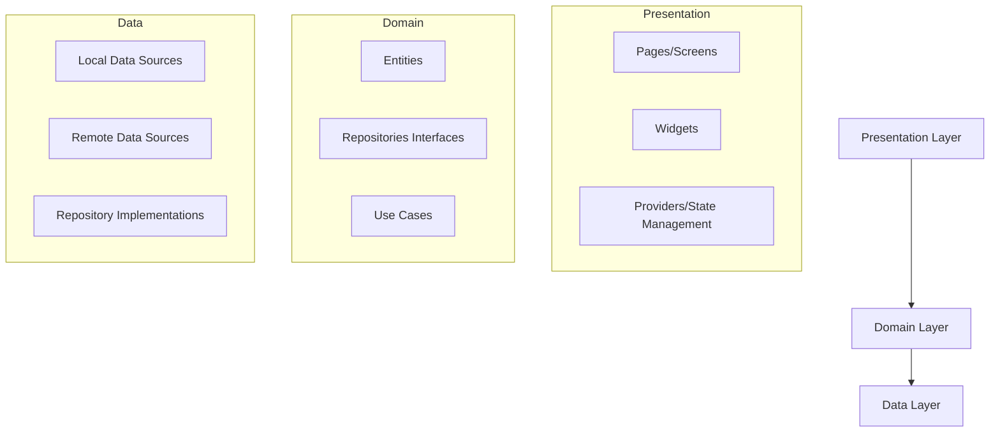
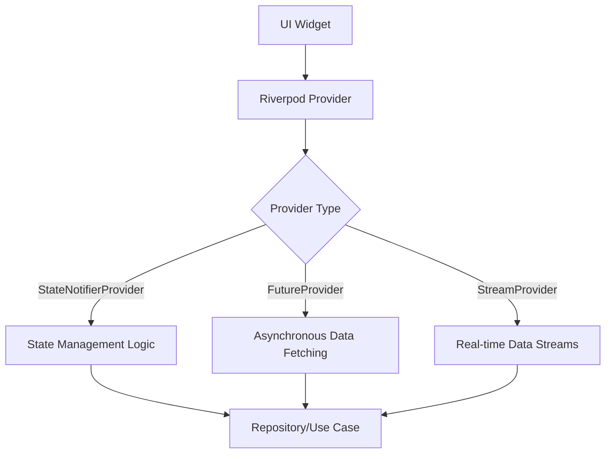
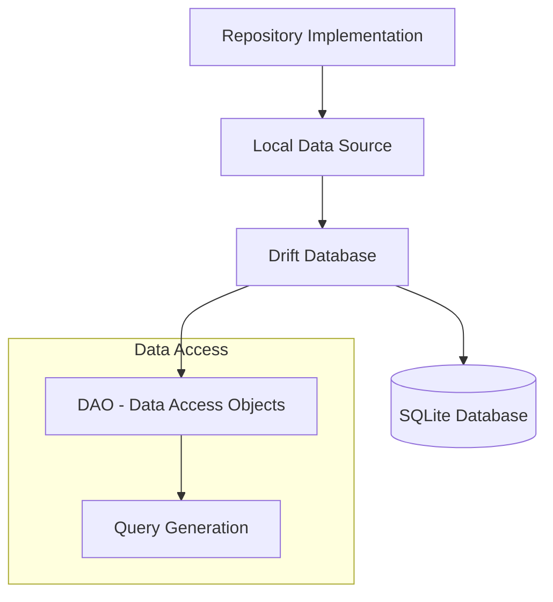
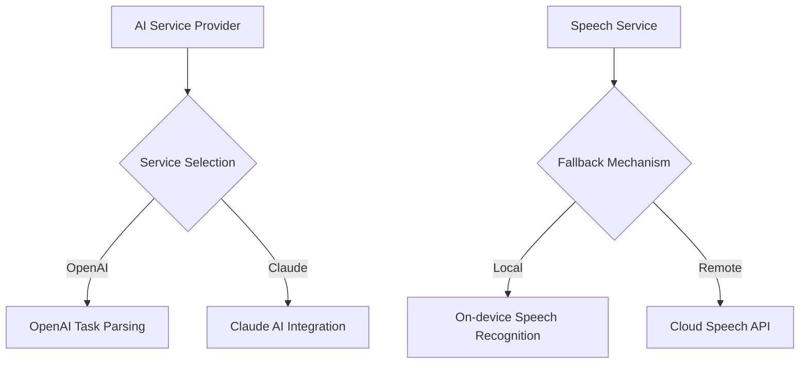
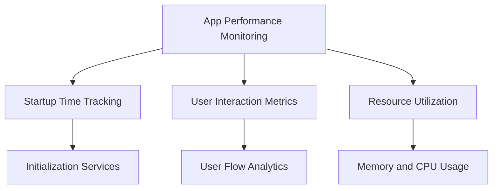
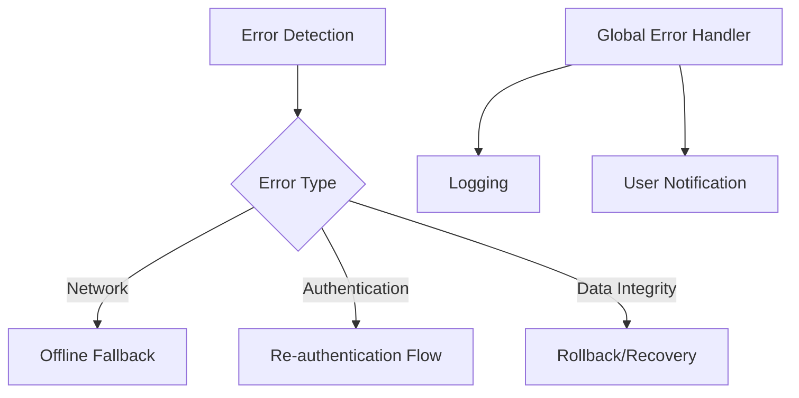

# Tasky Application Architecture Documentation

## 1. Architectural Overview: Clean Architecture Implementation

### Architecture Layers

### Key Architectural Principles

1. **Separation of Concerns**: 
   - **Presentation Layer**: Handles UI and user interactions
   - **Domain Layer**: Contains business logic and core entities
   - **Data Layer**: Manages data retrieval and storage

2. **Dependency Rule**:
   - Inner layers (Domain) are independent of outer layers
   - Dependency flow is unidirectional: Presentation → Domain → Data
   - Outer layers depend on inner layers, never vice versa

## 2. State Management: Riverpod Providers

### State Management Architecture

### Provider Categories
- **Core Providers**: Singleton services and global configurations
- **Feature Providers**: State management for specific features
- **Dependency Providers**: Injection of services and repositories

## 3. Data Layer: SQLite with Drift ORM

### Database Architecture

### Key Database Characteristics
- Type-safe database operations
- Code-generated DAOs
- Supports complex queries and relationships
- Offline-first data storage strategy

## 4. AI and External Services Integration

### Service Integration Strategies
- Multiple AI providers with fallback mechanisms
- Configurable API key management
- Abstracted service interfaces for easy extension

## 5. Performance and Monitoring

### Performance Monitoring Strategy

## 6. Error Handling and Resilience

## Architectural Principles

1. **Type Safety**: Extensive use of sealed classes and enums
2. **Dependency Injection**: Centralized through Riverpod
3. **Immutability**: Prefer immutable data structures
4. **Composability**: Modular and loosely coupled components

## Performance Benchmarks

- **AI Parsing**: <50ms (simple text), <500ms (complex)
- **Task Operations**: <100ms for 1000 operations
- **UI Rendering**: <100ms for complex widgets

## Development Best Practices

- Strict linting rules
- Comprehensive test coverage
- Performance monitoring
- Continuous refactoring
