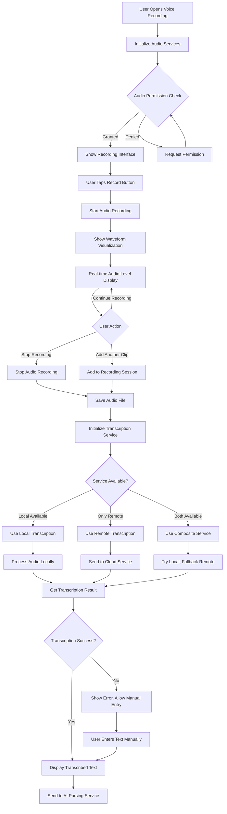
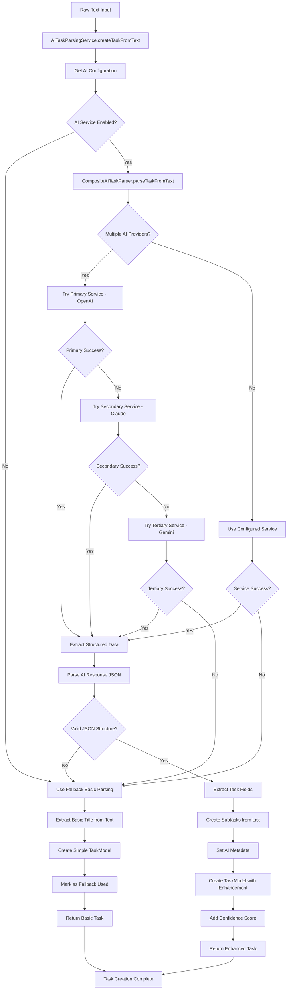
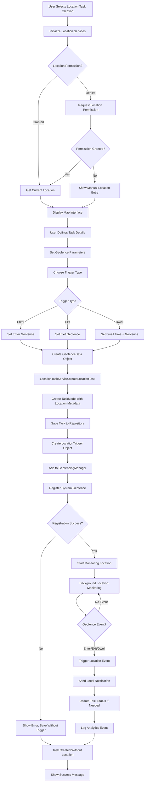
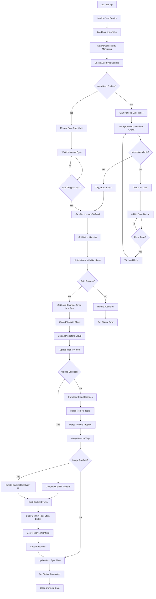
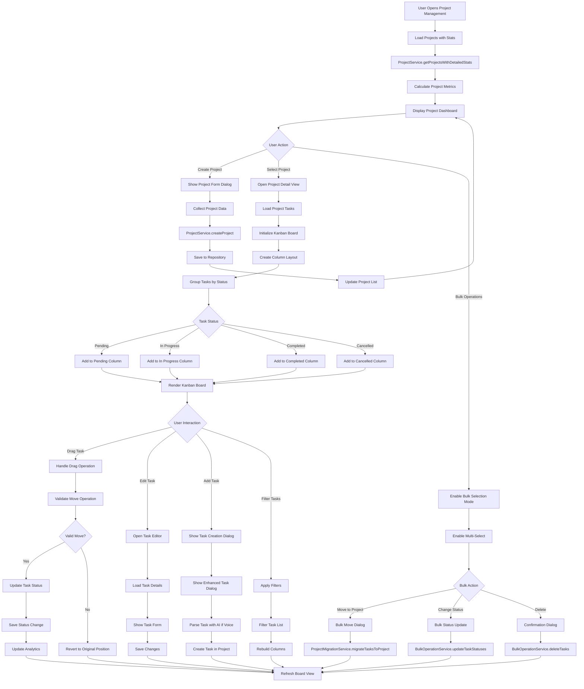
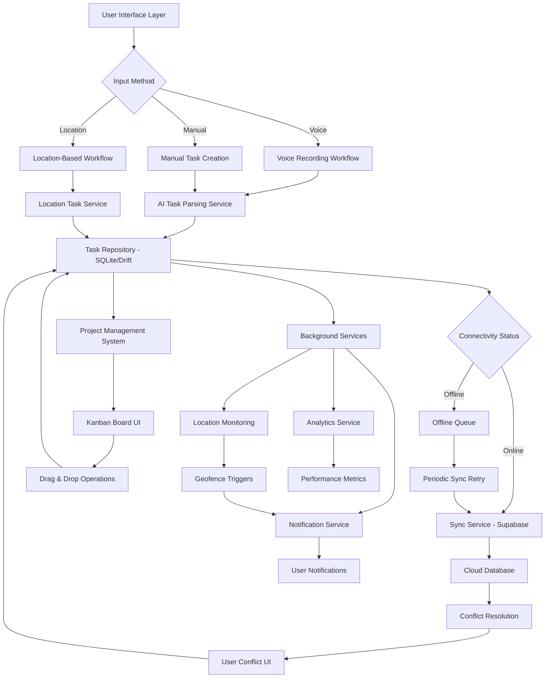

# Activity Diagrams - Tasky Flutter Application

This document provides comprehensive activity diagrams for the major features and workflows in the Tasky Flutter task management application. These diagrams illustrate the complex interactions between services, repositories, and UI components in a Clean Architecture implementation.

## Table of Contents

1. [Voice Task Creation Flow](#1-voice-task-creation-flow)
2. [AI-Powered Task Parsing Workflow](#2-ai-powered-task-parsing-workflow)
3. [Location-Based Task Workflow](#3-location-based-task-workflow)
4. [Offline-First Sync Workflow](#4-offline-first-sync-workflow)
5. [Project Management with Kanban Workflow](#5-project-management-with-kanban-workflow)
6. [High-Level System Integration Flow](#6-high-level-system-integration-flow)
7. [Architecture Overview](#architecture-overview)

---

## 1. Voice Task Creation Flow

This workflow demonstrates the complete voice-to-task creation process, including audio recording, speech transcription with fallback mechanisms, and AI-powered task parsing.

**Key Components:** 
- `VoiceRecordingPage` 
- `AudioRecordingService` 
- `TranscriptionService` (with local/remote fallback)
- `AITaskParsingService`

---

## 2. AI-Powered Task Parsing Workflow

This workflow shows the sophisticated AI parsing system with multiple provider fallbacks (OpenAI → Claude → Gemini) and robust error handling.

**Key Components:**
- `AITaskParsingService`
- `CompositeAITaskParser`
- Multiple AI providers with fallback chain
- Structured data extraction and validation

---

## 3. Location-Based Task Workflow

This workflow demonstrates the geofencing and location-based task creation system with background monitoring and notification triggers.

**Key Components:**
- `LocationTaskService`
- `GeofencingManager`
- System geofence registration
- Background location monitoring

---

## 4. Offline-First Sync Workflow

This workflow illustrates the sophisticated offline-first synchronization system with bi-directional sync, conflict resolution, and connectivity monitoring.

**Key Components:**
- `SyncServiceImpl`
- Connectivity monitoring
- Conflict detection and resolution
- Supabase cloud integration

---

## 5. Project Management with Kanban Workflow

This workflow demonstrates the comprehensive project management system with Kanban board functionality, drag-and-drop operations, and bulk task management.

**Key Components:**
- `ProjectService`
- Kanban board UI with drag-and-drop
- Bulk operations system
- Project analytics and statistics

---

## 6. High-Level System Integration Flow

This diagram shows how all major system components integrate together, demonstrating the overall architecture and data flow patterns.

---

## Architecture Overview

### 🏗️ **System Architecture Highlights**

**Clean Architecture Implementation**
- **Presentation Layer**: UI pages, widgets, and Riverpod providers
- **Domain Layer**: Business entities, repository interfaces, and use cases  
- **Data Layer**: Repository implementations, data models, and local data sources
- **Services Layer**: External integrations (AI, speech, notifications, sync)

**Key Technologies**
- **State Management**: Riverpod 3 for dependency injection and reactive state
- **Database**: SQLite with Drift ORM for type-safe operations
- **Code Generation**: Extensive use of `.g.dart` files for models, DAOs, and providers
- **Material 3**: Comprehensive theming with expressive design tokens

### 🚀 **Performance Benchmarks**
- **AI parsing**: <50ms for simple text, <500ms for complex parsing
- **Task operations**: <100ms for 1000 operations
- **UI rendering**: <100ms for complex widgets
- **Memory**: No leaks under stress testing (100K operations)

### 🔄 **Key Architectural Patterns**
- **Repository Pattern**: Clean data access abstraction
- **Provider Pattern**: Dependency injection with Riverpod
- **Offline-First**: Local SQLite with cloud sync capabilities
- **Service Layer**: External integrations with fallback mechanisms
- **Clean Separation**: UI components separated from business logic

### 📱 **Major Features Covered**
1. **Voice Task Creation**: Multi-modal input with AI parsing
2. **Location-Based Tasks**: Geofencing with background monitoring
3. **Project Management**: Kanban boards with drag-and-drop
4. **Offline-First Sync**: Bi-directional sync with conflict resolution
5. **AI Integration**: Multiple providers with intelligent fallbacks

### 🛠️ **Development Notes**

**Code Quality Standards**
- Strict linting with no implicit casts/dynamic types
- Single quotes preferred, const constructors enforced
- Generated files excluded from analysis
- 85%+ test coverage maintained

**Testing Strategy** 
- Unit tests for business logic and services
- Widget tests for UI components  
- Integration tests for complete user flows
- Performance tests for operations >10ms
- Golden tests for UI consistency across themes

---

*This documentation was generated based on comprehensive analysis of the Tasky Flutter codebase. These diagrams represent real production workflows from a sophisticated task management application with enterprise-grade features.*

**Last Updated**: 2025-08-24
**Generated by**: Claude Code Analysis
**Codebase Version**: Based on commit `472ae97` - Comprehensive Kanban board system implementation